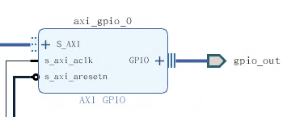
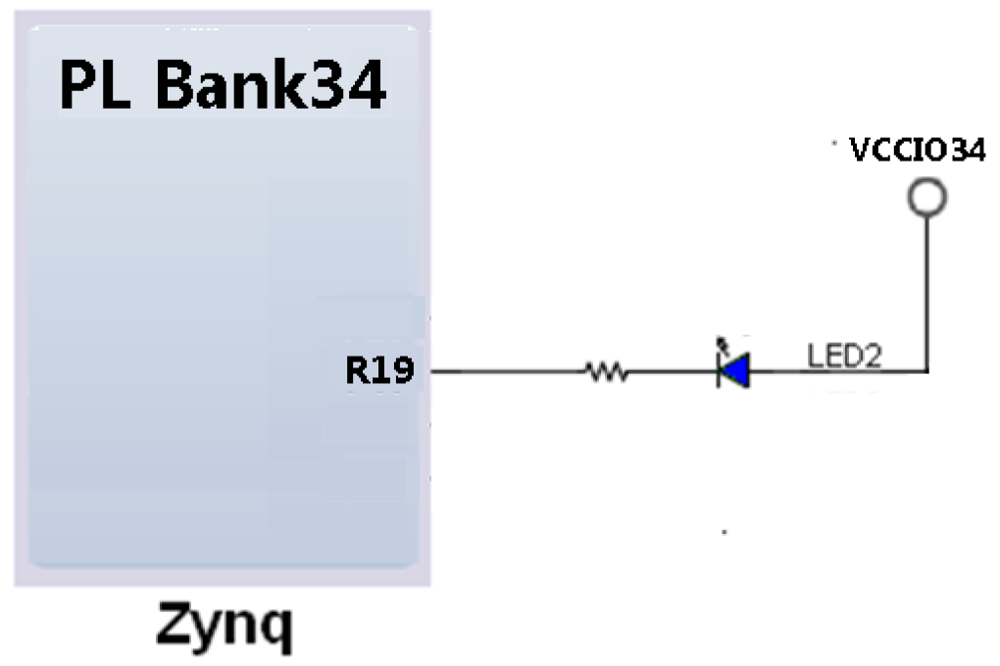
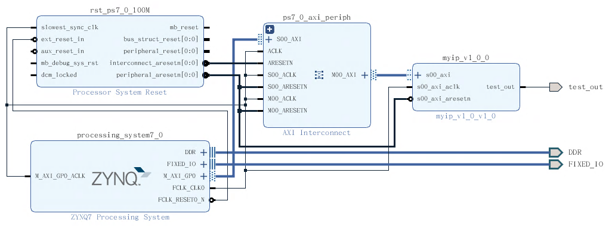
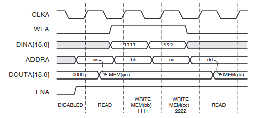
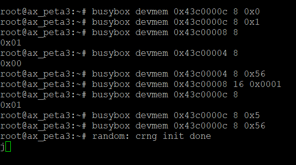

## Petalinux 安装配置和使用以及通过 linux 对 FPGA 的寄存器或者 RAM 进行读写

> why petalinux?

> 比分步编译更便捷的配置和编译源码。

- 优势：petalinux 读取输入硬件配置，并根据硬件来自动的配置编译 u-boot，kernel，devicetree.

- 缺点：软件对系统版本，依赖版本要求比较高，配置相对麻烦。如果不按照规定好的顺序执行命令会遇上较多未知 BUG.

- 目的：简化编译的过程，缩短时间并生成与硬件对应的正确的设备树文件。

### petalinux 的安装

petalinux 对操作系统版本和依赖版本要求很高，经过测试在 ubuntu18.04 上安装失败。

- OS: ubuntu16.04(docker x86-64)
- Dependencies:

```bash

sudo dpkg --add-architecture i386

sudo apt install libssl-dev flex bison chrpath socat autoconf libtool texinfo gcc-multilib libsdl1.2-dev libglib2.0-dev screen pax net-tools wget diffstat xterm gawk xvfb git make libncurse5-dev tftpd zlib1g libssl-dev gnupg tar unzip build-essential libtool-bin dialog cpio lsb-release zlib1g:i386 zlib1g-dev:i386 locales openjdk-8-jdk

sudo dpkg-reconfigure locales

export LANG=en_US.UTF-8
```

### petalinux 的使用

1. 创建一个 ZYNQ 的工程模板：

```bash
petalinux-create --type project --template zynq --name petalinux
```

2. 读取分析硬件所使用的开发版型号来配置：

```bash
petalinux-config --get-hw-description /mnt/linux_base.sdk
```

3. 配置内核和根文件系统：

```bash
petalinux-config -c kernel
petalinux-config -c rootfs
```

4. 开始编译：

```bash
petalinux-build
```

5. 将编译好的工程打包输出：

```bash
petalinux-package --boot --fsbl ./images/linux/zynq_fsbl.elf --fpga --u-boot --force
```

6. 使用 qemu 虚拟化平台对产生的 BootLoader 和 linux 内核进行测试（可选）

```bash
petalinux-boot --qemu --prebuilt 3
```

7. 将输出的文件移动到开发板启动，或者使用 tftp 方式远程启动：
   image.ub: linux 的内核镜像，并且打包了设备树文件 plnx_arm-system.dtb, 在内存中运行的文件系统 ramdisk.

```python
# image.ub
images {
                kernel@0 {
                        description = "Linux Kernel";
                        data = /incbin/("zImage");
                        type = "kernel";
                        arch = "arm";
                        os = "linux";
                        compression = "none";
                        load = <0x8000>;
                        entry = <0x8000>;
                        hash@1 {
                                algo = "sha1";
                        };
                };
                fdt@0 {
                        description = "Flattened Device Tree blob";
                        data = /incbin/("plnx_arm-system.dtb");
                        type = "flat_dt";
                        arch = "arm";
                        compression = "none";
                        hash@1 {
                                algo = "sha1";
                        };
                };
                ramdisk@0 {
                        description = "ramdisk";
                        data = /incbin/("petalinux-user-image-plnx_arm.cpio.gz");
                        type = "ramdisk";
                        arch = "arm";
                        os = "linux";
                        compression = "none";
                        hash@1 {
                                algo = "sha1";
                        };
                };
        };
```

### petalinux 产生设备树的分析

使用 petalinux 的优势：自动分析硬件并产生设备树，也可以添加需要的部分并手动编译。

- 产生设备树的目录：

```bash
$(project)/components/plnx_workspace/device-tree/device-tree-generation/
```

- 设备树主要分两个部分：
  1. ARM CPU 相关的设备包括处理器内存，系统总线等等，在 zynq-7000.dtsi 中。（dtsi:设备树中描述 SOC 级的信息，一般不需要修改；dts: 设备树的源文件，修改设备树的主要对象；dtb: 由 dts 文件编译生成的二进制文件，由内核在启动时候读取并解析）
  2. petalinux 根据硬件的配置来生成 pl.dtsi 文件，文件内包括在根节点下的 FPGA 部分的设备树。
  3. pl.dtsi 和 zynq-7000.dtsi 包含在 system-top.dts 内，手动添加的设备树也包含在内。
  4. plnx_arm-system.dts 是处理了包含关系后的文件，编译生成 plnx_arm-system.dtb.

```bash
pl.dtsi  -----------|
pcw.dtsi -----------|----> system-top.dts ----> plnx_arm-system.dts -----(dtc)----> plnx_arm-system.dtb
zynq-7000.dtsi -----|
```

### 实验：产生 GPIO 设备树文件，使用 Linux 内的 gpio 驱动程序，用文件 IO 方式驱动 led

系统：



描述：PS 和 PL 各有一个 led，通过 petalinux 产生一个完整 linux 系统，FPGA 端烧写一个 GPIO 控制器，输出 1 位信号到 R19 引脚，FPGA 的 R19 引脚连接了 pl 侧的 led 灯：



```tcl
set_property PACKAGE_PIN R19 [get_ports {gpio_out}] # R19引脚连接板上的led灯
set_property IOSTANDARD LVCMOS33 [get_ports {gpio_out}]
```

linux 内核包含了 gpio 的驱动，可以根据设备树信息来自动检测硬件

```sh
$ cd /sys/class/gpio && ls

export  gpiochip906  gpiochip504  unexport

# 访问/sys/class/gpio/目录，gpio906和gpio504分别是PS端和PL端的gpio控制器, export是内核提供的文件用于导出gpio的操作接口。

$ echo 906 > export
$ echo 504 > export

# 向export文件写入GPIO编号，就可以获得这个GPIO的操作接口。

$ ls

export gpio906 gpiochip906 gpio504 gpiochip504 unexport

# 新产生了gpio906和gpio504目录，目录中就是操作接口。

$ cd gpio906 && ls

active_low  direction  power  uevent  device  edge  subsystem  value

# direction控制gpio的方向，value为gpio的输入输出值。

$ echo out > direction
$ echo 1 > value          # led灯灭
$ echo 0 > value          # led灯亮

# 通过一般的IO操作value这个文件就可以控制灯的亮灭。
```

产生的 GPIO 设备树部分(FPGA 侧):

```c
axi_gpio_0: gpio@41200000 {
			#gpio-cells = <2>;
			compatible = "xlnx,xps-gpio-1.00.a";
			gpio-controller ;
			reg = <0x41200000 0x10000>;
			xlnx,all-inputs = <0x0>;
			xlnx,all-inputs-2 = <0x0>;
			xlnx,all-outputs = <0x1>;
			xlnx,all-outputs-2 = <0x0>;
			xlnx,dout-default = <0x00000000>;
			xlnx,dout-default-2 = <0x00000000>;
			xlnx,gpio-width = <0x1>;
			xlnx,gpio2-width = <0x20>;
			xlnx,interrupt-present = <0x0>;
			xlnx,is-dual = <0x0>;
			xlnx,tri-default = <0xFFFFFFFF>;
			xlnx,tri-default-2 = <0xFFFFFFFF>;
		};
```

### 实验：直接将 FPGA 寄存器信号输出到 R19 引脚，通过 AXI-Lite 总线读写寄存器来控制 led

硬件系统：

定义一个 32-bits 寄存器来接受总线信号，写入寄存器的值取一位输出到 led 灯

```verilog
# 定义一个32位寄存器
reg [C_S_AXI_DATA_WIDTH-1:0]	slv_reg0;

# 将寄存器的第0位连接到输出信号
assign test_out = slv_reg0[0];

# 将总线模块打包，在test中调用AXI总线，添加一个输出信号test_out
myip_v1_0_S00_AXI # (
		.C_S_AXI_DATA_WIDTH(C_S00_AXI_DATA_WIDTH),
		.C_S_AXI_ADDR_WIDTH(C_S00_AXI_ADDR_WIDTH)
	) myip_v1_0_S00_AXI_inst (
		.S_AXI_ACLK(s00_axi_aclk),
		.S_AXI_ARESETN(s00_axi_aresetn),
		.S_AXI_AWADDR(s00_axi_awaddr),
		.S_AXI_AWPROT(s00_axi_awprot),
		.S_AXI_AWVALID(s00_axi_awvalid),
		.S_AXI_AWREADY(s00_axi_awready),
		.S_AXI_WDATA(s00_axi_wdata),
		.S_AXI_WSTRB(s00_axi_wstrb),
		.S_AXI_WVALID(s00_axi_wvalid),
		.S_AXI_WREADY(s00_axi_wready),
		.S_AXI_BRESP(s00_axi_bresp),
		.S_AXI_BVALID(s00_axi_bvalid),
		.S_AXI_BREADY(s00_axi_bready),
		.S_AXI_ARADDR(s00_axi_araddr),
		.S_AXI_ARPROT(s00_axi_arprot),
		.S_AXI_ARVALID(s00_axi_arvalid),
		.S_AXI_ARREADY(s00_axi_arready),
		.S_AXI_RDATA(s00_axi_rdata),
		.S_AXI_RRESP(s00_axi_rresp),
		.S_AXI_RVALID(s00_axi_rvalid),
		.S_AXI_RREADY(s00_axi_rready),
		.test_out(test_out)
	);

# 修改wrapper添加输出信号
output wire test_out

# 绑定输出信号到led灯相连的引脚
set_property PACKAGE_PIN R19 [get_ports {test_out}]
set_property IOSTANDARD LVCMOS33 [get_ports {test_out}]
```

petalinux 根据系统硬件设计添加了 AXI-Lite 总线对应的设备树部分

```c
# amba-axi总线的设备树部分
/ {
	amba_pl: amba_pl {
		#address-cells = <1>;
		#size-cells = <1>;
		compatible = "simple-bus";
		ranges ;
		myip_v1_0_0: myip_v1_0@43c00000 {     # 寄存器的物理地址是0x43c00000
			compatible = "xlnx,myip-v1-0-1.0";
			reg = <0x43c00000 0x10000>;
			xlnx,s00-axi-addr-width = <0x4>;
			xlnx,s00-axi-data-width = <0x20>;
		};
	};
};
```

寄存器的物理地址是 0x43c00000，对这个地址的第一个字节的 0 位写值就可以控制 led 灯的亮灭

```bash
$ busybox devmem 0x43c00000 8 0x01         # 灯灭
$ busybox devmem 0x43c00000 8 0x00         # 灯亮
```

~~Q: 最小的寄存器组: 4 个(0x43c00000-0x43c0000f), 从 0x40000000-0x4fffffff 全部被映射到了最初的 16 个字节。~~
实际上被映射的物理内存区域有 1G，从地址 0x40000000-0x4fffffff

### 测试：从 Linux 端读写寄存器，寄存器连接一个宽度 16bit，深度 256 的 Block RAM，通过读写 3 个寄存器来实现对 Block RAM 的指定地址的读写。

系统结构：
这是一个 16bit x 256 的 memory：


这是我使用的 IP 的层级：


由一个 TOP 模块，来例化了一个 AXI-Lite 总线接口，这个总线接口定义了 60 个寄存器并且引出。还有一个 BlockRAM 模块，将 AXI 总线定义的三个寄存器输入到 RAM 的控制接口里，然后通过对总线读写来控制 RAM。



AXI 总线模块：

```verilog
AXI_Lite axi_lite

       (.register00(AXI_Lite_register00),

        .register01(AXI_Lite_register01),

        .register02(AXI_Lite_register02),

        .register03(AXI_Lite_register03),

        .register04(AXI_Lite_register04),

        .register05(AXI_Lite_register05),

        .register06(AXI_Lite_register06),

        .register07(AXI_Lite_register07),

        .register08(AXI_Lite_register08),

        .register09(AXI_Lite_register09),

        .register10(AXI_Lite_register10),

		......
```

对 BlockRAM 的接口定义：

```verilog
bram_wrapper mappingRAM

    (
        # 写地址：0x000-0x100(深度256)
        .BRAM_PORTA_0_addr(AXI_Lite_register01[7:0]),

        # 写时钟：FCLK_CLK0
        .BRAM_PORTA_0_clk(s00_axi_aclk_0_1),

        # 写数据：16bit数据
        .BRAM_PORTA_0_din(AXI_Lite_register02[15:0]),

        # PORTA使能
        .BRAM_PORTA_0_en(1'b1),

        # PORTA写使能
        .BRAM_PORTA_0_we(1'b1),

        # PORTB读地址
        .BRAM_PORTB_0_addr(AXI_Lite_register03[7:0]),

        # PORTB读时钟
        .BRAM_PORTB_0_clk(s00_axi_aclk_0_1),

        # PORTB读数据
        .BRAM_PORTB_0_dout(w_ramout[15:0]),

        # PORTB读使能
        .BRAM_PORTB_0_en(1'b1)

    );
```

这是调用 IP 的顶层模块：


ramout_0 -> led(R19)

```bash
# register
  ————————————————————                                       ————————————-
  | register01[7:0]  |  ————> 写地址，输入到PORTA addr ——————> |            |
  ————————————————————
  | register02[15:0] |  ————> 写数据，输入到PORTA din  ——————> |  256 x 16  |
  ————————————————————
  | register03[7:0]  |  ————> 读地址，输入到PORTB addr ——————> |            |
  ————————————————————                                       ————————————-
                                                                   |
                            ramout[0]       ——————————————         |
                  led  <———————————————————| ramout[15:0] |—————————
                                            ——————————————
```

测试过程:

```bash
# 初始状态：ram内全部清零，ramout[0] 输出为0，"led灯亮"

# 给RAM的写地址端口写入0x43c00004
$ busybox devmem 0x43c00004 8 0x55

# 给RAM的写数据端口写入16位数据0x0001
$ busybox devmem 0x43c00008 16 0x0001

此时RAM的0x55地址写入了数据 0000 0000 0000 0001

# 给0x43c0000c地址写入0x55，表示给RAM的读地址端口写0x55
$ busybox devmem 0x43c0000c 8 0x55

此时ramout的第0位由0变成了1，"led灯灭"

# 把0x55的数据重新写为0
$ busybox devmem 0x43c00008 16 0x0000

"led灯亮"

# 或者改变读地址的值
$ busybox devmem 0x43c0000c 8 0x56

"led灯亮"

```



证明数据写入 RAM 成功
